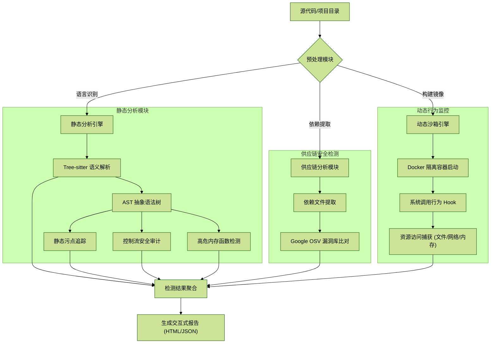

# 🛡️ Argus-Scanner - 代码哨兵

> 🎓 **BUPT SCSS 《网络安全课程设计》优秀作品**

[](https://www.python.org/)
[](https://github.com/shiqianzheng/Argus-Scanner)
[](https://www.docker.com/)
[]()

> **开源软件后门木马和安全漏洞检测系统**
> 基于抽象语法树 (AST) 的语义级分析引擎，辅以 Docker 沙箱化动态监控，为代码安全保驾护航。本项目具备内存安全分析模块。

---

## 📖 项目简介

Argus-Scanner 是一款专为开发者和安全审计人员设计的代码安全扫描工具。它能够识别代码中的恶意后门、逻辑漏洞及隐蔽的攻击矢量。项目核心基于 **Tree-sitter** 统一语法引擎，深入语义层进行分析，有效规避了传统正则匹配的高误报率。

Argus-Scanner 特别引入了**先进的内存分析能力**，能够检测无文件攻击（Fileless Attacks）和高危内存操作。

## 🏗️ 系统架构设计 (System Architecture)

Argus-Scanner 采用 **"静态分析 + SCA 成分分析 + 动态沙箱"** 的三维一体纵深防御架构。



### 🌟 核心特性

-   **多语言全覆盖**: 深度支持 Python, Java, Go, C, C++ 等主流编程语言。
-   **语义级静态分析 (Static Analysis)**:
    -   **污点分析 (Taint)**: 追踪从输入源 (`source`) 到敏感汇聚点 (`sink`) 的全路径，精准识别 SQL 注入、命令执行等漏洞。
    -   **[新增] 内存安全检测**: 
        *   **指针逃逸分析**: 深度追踪 C/C++ 中不安全的指针传递与越界读写风险。
        *   **香农熵降噪**: 引入信息论算法 (Threshold=4.5)，自动过滤 Base64 图片等高熵值造成的误报。
    -   **控制流 & 数据流**: 分析异常逻辑跳转与变量隐式依赖。
-   **沙箱化动态监控 (Dynamic Analysis)**:
    -   **Docker 物理隔离**: 所有动态测试均在 Docker 容器内运行，保障宿主机绝对安全。
    -   **[增强] 行为感知**: 实时捕获文件删除、网络外联 (C2)、以及**高危内存系统调用 (mmap/mprotect/memfd_create)**，有效防御无文件攻击。
-   **现代化报表**: 自动生成交互式 HTML 报告，图表化展示漏洞分布，并提供专业的修复建议。
-   **Web 可视化**: 内置 Web 界面，支持代码片段在线扫描与一键生成报告。

---

## 🛠️ 安装与配置

### 前置要求
-   **Python 3.8+**
-   **Docker Desktop** (必须安装并启动，用于启用核心的沙箱动态监控功能)
-   **Git**

### 快速安装
1.  **克隆仓库**
    ```bash
    git clone https://github.com/shiqianzheng/Argus-Scanner.git
    cd Argus-Scanner
    ```
2.  **安装依赖**
    ```bash
    # 包含 docker python 库
    pip install -r requirements.txt
    ```
3.  **环境检查**
    ```bash
    python check_env.py
    ```

---

## 💻 使用指南

Argus-Scanner 提供 **命令行 (CLI)** 和 **Web 网页** 两种交互方式。

### 1. Web 交互模式 (推荐)
提供直观的可视化界面，适合快速上手。

**启动方式：**
```bash
python main.py --web --port 5000
```
启动后，在浏览器访问 `http://127.0.0.1:5000` 即可使用。v1.1.0 界面已更新，支持展示内存分析结果。

### 2. 命令行模式 (CLI)
适合集成到 CI/CD 流程或批量处理。

**基础用法：**
```bash
# 扫描指定目录，生成 HTML 报告
python main.py ./src/my_project

# 仅静态分析，指定语言为 Java
python main.py ./src/java_app --static-only --language java
```

**参数说明：**

| 命令参数 | 描述 | 示例 |
| :--- | :--- | :--- |
| `target` | 扫描目标 (文件或目录) | `python main.py ./src` |
| `-f, --format` | 报告格式: `html`, `json`, `text` | `-f json` |
| `-o, --output` | 报告输出目录 (默认: `./reports`) | `-o ./audit_logs` |
| `--static-only` | 仅进行静态语义分析 | `--static-only` |
| `--dynamic-only`| 仅在 Docker 沙箱中进行动态分析 | `--dynamic-only` |
| `--language` | 指定语言: `python`, `java`, `go`, `c`, `cpp`, `auto` | `--language go` |
| `--config` | 指定自定义配置文件路径 | `--config ./my_config.yaml` |

---

## 🗂️ 项目结构

```text
Argus-Scanner/
├── analyzers/              # 核心分析组件
│   ├── static/             # 静态分析引擎
│   │   ├── taint.py        # 污点分析 (Updated)
│   │   ├── memory.py       # 内存安全分析 (New)
│   │   ├── controlflow.py  # 控制流分析
│   │   └── pattern_matcher.py
│   └── dynamic/            # 动态监控引擎
│       ├── sandbox.py      # Docker 沙箱管理器
│       ├── syscall_monitor.py # 系统调用追踪 (strace)
│       └── ...
├── core/                   # 框架核心逻辑
│   ├── scanner.py          # 扫描调度器
│   └── report.py           # 报告生成器 (Jinja2)
├── rules/                  # 检测规则库
│   ├── dynamic_rules.yaml  # 动态行为规则 (New: Memory rules)
│   └── ...
├── web/                    # Web 前端与 API 实现
├── templates/              # HTML 报告模板
├── utils/                  # 工具函数类
└── main.py                 # 程序统一入口
```

---

## ⚙️ 高级配置

您可以通过修改 `config.yaml` 或 `rules/dynamic_rules.yaml` 来定制扫描行为。

### 动态规则配置 (rules/dynamic_rules.yaml)
v1.1.0 支持自定义动态监控规则。例如，您可以定义什么行为被视为"恶意内存操作"：

```yaml
# 内存活动规则示例
- id: MEM-001
  title: "可执行内存分配 (mmap)"
  pattern: 'mprotect.*PROT_EXEC.*'
  severity: HIGH
  category: memory

- id: MEM-C-FILELESS-INTENT
  title: "无文件执行意图 (memfd_create)"
  pattern: 'memfd_create'
  severity: CRITICAL
  category: memory
```


---

## 🤝 贡献与反馈

感谢你参与 **Argus-Scanner** 的开发！为了保持项目代码质量并确保协作顺畅，请在提交代码前阅读本指南。

### 🛠 开发流程

我们推荐使用 **Fork + Pull Request** 的模式进行协作。

#### 1. 准备工作
* **Fork 项目**：点击页面右上角的 `Fork` 按钮，将本项目复制到你的个人账号下。
* **克隆到本地**：建议使用 [GitHub Desktop](https://desktop.github.com/) 将你 Fork 后的仓库克隆到本地。
* **保持同步**：在开始新功能前，点击 GitHub Desktop 中的 `Fetch origin` 并确保你的 `main` 分支与原仓库同步。

#### 2. 创建分支 (Branch)
* 始终在新的分支上工作，不要直接修改 `main` 分支。
* 分支命名建议：`feat-功能名` 或 `fix-问题名`。

#### 3. 提交修改 (Commit)
* **小步提交**：频繁提交小的改动，而不是累积大量改动后一次性提交。
* **描述清晰**：在 GitHub Desktop 的 Summary 框中简述你的改动原因。

#### 4. 发送 Pull Request (PR)
* **推送分支**：在 GitHub Desktop 中点击 `Publish branch` 将分支上传到你的 GitHub 账号。
* **发起 PR**：回到本仓库（原仓库）页面，点击绿色的 `Compare & pull request` 按钮。
* **检查对比方向**：
    * **base repository**: `shiqianzheng/Argus-Scanner` (main)
    * **head repository**: `你的账号/Argus-Scanner` (你的分支)

### 📝 代码要求

* **可运行**：在提交 PR 前，请务必在本地运行扫描器，确保没有语法错误或崩溃。
* **简洁性**：尽量保持逻辑清晰，复杂的逻辑请添加中文注释。
* **依赖项**：如果你引入了新的 Python 库，请务必更新 `requirements.txt`。

### 🤝 评审与合并

* **代码评审**：我会尽快查看你的 PR。如果我提出了修改建议，你只需在本地继续修改并 Push，PR 会自动更新。
* **合并**：一旦审核通过，我会将你的代码通过 `Squash and merge` 方式合并入主分支。

---
感谢你的贡献！让我们一起把 Argus-Scanner 变得更好！

### 📚 致谢 (Acknowledgements)
本项目在开发过程中参考了以下优秀的开源项目，特此感谢：

-   **[Tree-sitter](https://tree-sitter.github.io/)**: 提供了强大的增量式解析引擎，是本项目 AST 分析的核心基石。
-   **[Semgrep](https://semgrep.dev/)**: 其基于 AST 的代码匹配思想对本项目的规则引擎设计有受到启发。
-   **[Bandit](https://github.com/PyCQA/bandit)**: 提供了高质量的 Python 安全检测规则集参考。
-   **[OSV-Scanner](https://github.com/google/osv-scanner)**: 本项目的依赖漏洞检测使用了 Google OSV 数据库。

 
